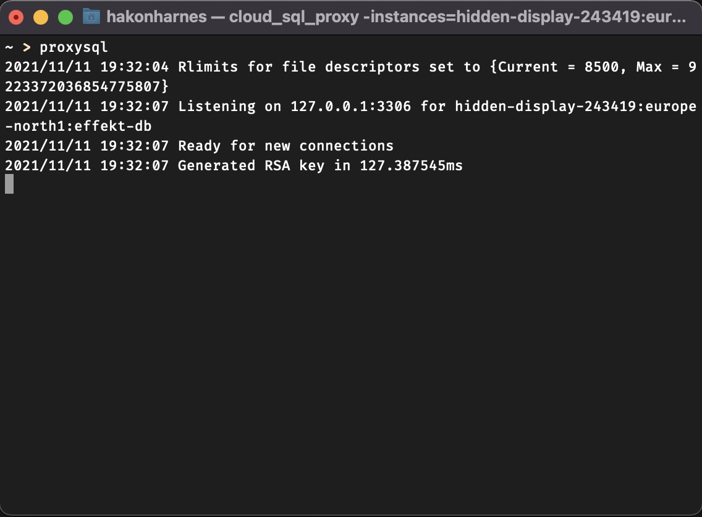
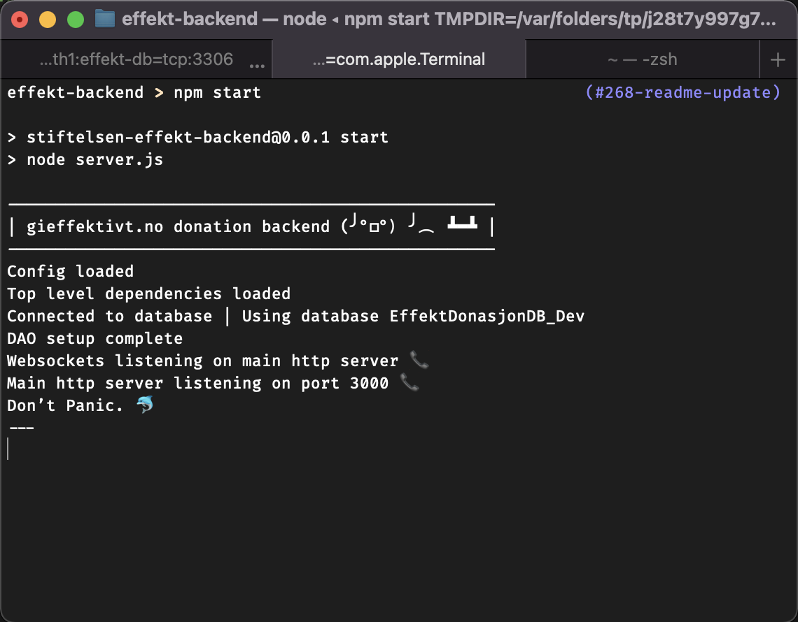
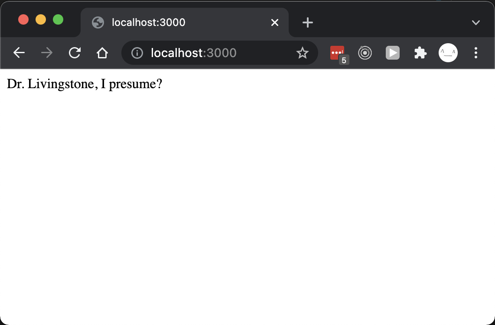
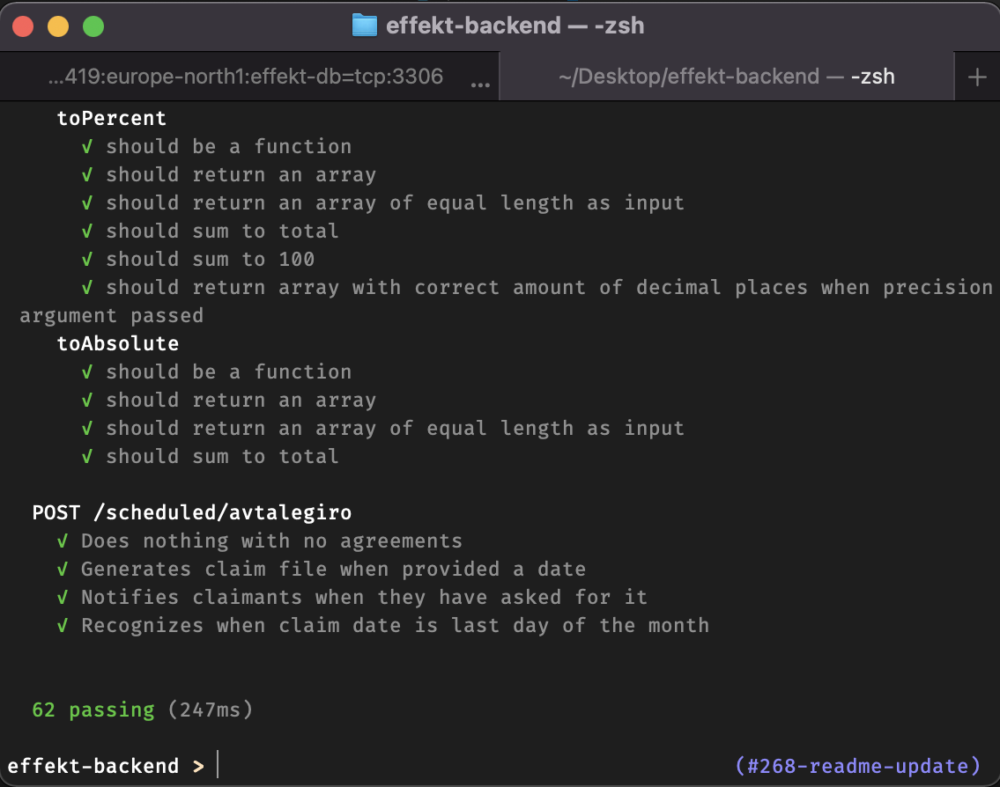
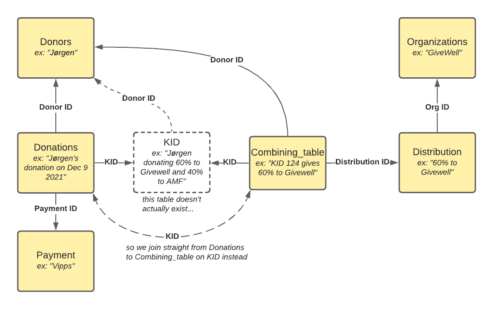

## Effect Foundation API

The Effect Foundation API is used by all our core application for data storage. The API is connected to a MySQL database, where our donation data is stored. This includes our donations, donors, donation distributions, recurring donation agreements, referral statistics, authentification info, payment methods and so on.

The API is also responsible for handling payment processing.

---

**Table of contents**

- [Effect Foundation API](#effect-foundation-api)
- [API endpoints](#api-endpoints)
- [Get started developing](#get-started-developing)
  - [Clone and install packages](#clone-and-install-packages)
  - [Setup MySQL](#setup-mysql)
    - [Run MySQL locally (no Docker)](#run-mysql-locally-no-docker)
    - [Run MySQL locally (inside a Docker container)](#run-mysql-locally-inside-a-docker-container)
    - [Set up local Schema](#set-up-local-schema)
    - [Add test data to your local MySQL instance](#add-test-data-to-your-local-mysql-instance)
  - [Google Cloud & Cloud Sql Auth Proxy setup](#google-cloud--cloud-sql-auth-proxy-setup)
    - [Google Cloud access](#google-cloud-access)
    - [Google Cloud Sql Auth Proxy setup](#google-cloud-sql-auth-proxy-setup)
  - [Configuring and running the API](#configuring-and-running-the-api)
  - [Testing](#testing)
- [Build and deployment](#build-and-deployment)
  - [Environments](#environments)
  - [Google cloud build](#google-cloud-build)
- [Code Structure & Implementation Details](#code-structure--implementation-details)
  - [Routes](#routes)
  - [Business logic](#business-logic)
  - [Authentication & Authorization](#authentication--authorization)
  - [KIDs](#kids)
  - [Data Access](#data-access)
  - [Email](#email)
  - [Logging](#logging)
  - [Views](#views)
  - [Scheduled jobs](#scheduled-jobs)
  - [Tests](#tests)
- [Database](#database)
  - [Tables Overview](#tables-overview)
  - [Database Schema Migrations](#database-schema-migrations)
    - [Downloading production schema](#downloading-production-schema)
- [Payment processing](#payment-processing)
  - [Bank](#bank)
  - [Vipps](#vipps)
  - [PayPal](#paypal)
  - [Facebook](#facebook)

---

## API endpoints

Our API endpoints are described in the swagger documentation available [here (production)](https://data.gieffektivt.no/docs/) or [here (development)](https://dev.data.gieffektivt.no/docs/)).

We are currently working on improving this documentation.

## Get started developing

To run the API locally, follow these setup steps:

1. Clone and install packages
2. Setup MySQL

### Clone and install packages

Clone this repository to your local machine:

```
git clone https://github.com/stiftelsen-effekt/effekt-backend.git
```

> **Note** To clone the repository, you must have access and be part of the [Stiftelsen Effekt github organization](https://github.com/stiftelsen-effekt). You must also be logged in on git on your local machine. If you do not have access to clone the repository, enquire on our [tech](https://effektteam.slack.com/archives/G011BE3BG3H) channel.

The api uses [node.js](https://nodejs.org/en/) and npm is the package manager. Go to the root folder of the cloned repository, and install the requisite packages with the command:

```
npm install
```

### Setup MySQL

There are three options for setting up MySQL for your local API service to connect to:

1. Run MySQL locally (no Docker)
2. Run MySQL locally (inside a Docker container)
3. Connect to the production database

Strongly prefer running locally (either with or without a Docker container), rather than connecting to the production database. It's easier to set up, and way safer - no chance of leaking personal info of our users, and no chance of writing invalid data to the production database.

Running locally is the easiest option if this is the only use for MySQL on your machine. Running locally inside Docker is a bit more difficult to set up and a bit more resource-intensive for your machine, but helps with isolation.

In any of the approaches, we're going to expose MySQL on the default MySQL port of 3306.

#### Run MySQL locally (no Docker)

If you use brew, installing MySQL is as easy as:

```
brew install mysql
```

The default user is `root`, let's set a password of `effekt`:

```
mysql -h 127.0.0.1 -uroot -e "ALTER USER 'root'@'localhost' IDENTIFIED BY 'effekt'; flush privileges;"
```

Now we can log in to the MySQL command prompt with:

```
mysql -h 127.0.0.1 -uroot -peffekt
```

On Mac or Linux, you can start MySQL with `mysql.server start` (and stop it with `mysql.server stop` if you want).

#### Run MySQL locally (inside a Docker container)

First, follow instructions on the Docker website (or look for an online tutorial) to get Docker installed and running on your machine. 

If you're on Mac, it should be as easy as:

```
brew cask install docker
```

Then run:

```
docker run --name effekt-mysql -p 3306:3306 -e MYSQL_ROOT_PASSWORD=effekt -d mysql:latest
```

This creates and runs a new Docker container named `effekt-mysql`, and runs MySQL inside the container. The default user is `root` with password `effekt`. It also sets up port forwarding, so your local port 3306 gets forwarded to port 3306 inside your Docker container (where MySQL is running).

Now we can log in to the MySQL command prompt with:

```
mysql -h 127.0.0.1 -uroot -peffekt
```

Some basic Docker commands:

- `docker ps` to list all currently-running containers
- `docker stop effekt-mysql` to stop the container
- `docker start effekt-mysql` to start the container
- `docker rm effekt-mysql` to remove the container

#### Set up local Schema

Now we want to set up the database to mirror production. First schema, then with some production-like data to develop against. Whether you're running MySQL natively or inside a Docker container, the steps are the same.

First, create a new "database" named `EffektDonasjonDB_Local`:

```
mysql -h 127.0.0.1 -uroot -peffekt -e 'create database EffektDonasjonDB_Local'
```

A snapshot of the production schema is stored in [db/prod_schema.sql](db/prod_schema.sql). Feel free to take a look - it's just sql commands for creating tables, adding indexes, etc. First one more setup step to work around an error message:

```
mysql -h 127.0.0.1 -uroot -peffekt -e 'SET GLOBAL log_bin_trust_function_creators = 1'
```

Now let's load in the schema:

```
mysql -h 127.0.0.1 -uroot -peffekt EffektDonasjonDB_Local < db/prod_schema.sql
```

To get your local schema fully up-to-date with the production schema, you'll also need to apply any migrations (commands which change the MySQL schema) that have been created in the [db/migrations](db/migrations) folder. We use the db-migrate tool. To apply all migrations, run:

```
npx db-migrate up --config db/database.json --migrations-dir db/migrations
```

If the output ends with `[INFO] Done`, it completed successfully.

Now, let's double check the schema is correct! Try:

```
mysql -h 127.0.0.1 -uroot -peffekt EffektDonasjonDB_Local -e 'show tables'
```

you should see output like:

```
+-----------------------------------+
| Tables_in_EffektDonasjonDB_Local  |
+-----------------------------------+
| Access_applications               |
| Access_applications_callbacks     |
| Access_applications_permissions   |
| Access_keys                       |
...
```

and when you run:

```
mysql -h 127.0.0.1 -uroot -peffekt EffektDonasjonDB_Local -e 'describe Donations'
```

you should see output like:

```
+---------------------+------------------------+------+-----+-------------------+-------------------+
| Field               | Type                   | Null | Key | Default           | Extra             |
+---------------------+------------------------+------+-----+-------------------+-------------------+
| ID                  | int                    | NO   | PRI | NULL              | auto_increment    |
| Donor_ID            | int                    | NO   | MUL | NULL              |                   |
| Payment_ID          | int                    | NO   | MUL | NULL              |                   |
| PaymentExternal_ID  | varchar(32)            | YES  | UNI | NULL              |                   |
...
```


#### Add test data to your local MySQL instance

TODO

### Google Cloud & Cloud Sql Auth Proxy setup

Most developers hopefully do not need to access the production MySQL instance for day-to-day development.

If you do need to access the production database, you'll use Google Cloud SQL Auth Proxy - it's a tool that sets up a tunnel from your machine to our production MySQL instance. Once you've finished setting it up, you'll be able to connect with the MySQL command prompt, a MySQL GUI, or connect using your locally-running Effekt Backend service.

#### Google Cloud access

First, make sure you have a google cloud account, and get someone in the team to authorize you with the SQL client privilege.

#### Google Cloud Sql Auth Proxy setup

First, follow setup instructions at https://cloud.google.com/sql/docs/mysql/connect-admin-proxy

The instance name of our database is `hidden-display-243419:europe-north1:effekt-db`. Thus, the command to setup the proxy is:

```
./cloud_sql_proxy -instances=hidden-display-243419:europe-north1:effekt-db=tcp:3306
```

if cloud_sql_proxy is located in the same folder in your terminal. We recommend you store the binary somewhere on your computer, and add it to your path.

It's also possible to create an alias on macos / linux to avoid having to type in the entire command each time you wish to connect.

If all has gone well, you should be seeing this in your terminal of choice.



The proxy is now listening for connections on port 3306 (the standard mysql port), and forwards any communication to the internal google cloud network through a secure tunnel.

### Configuring and running the API

Before we can run the API, we need to specify some environment variables. You can see all of the variables in [config.js](./config.js). Many of the variables declared here are not needed for most development. 

To get started, we **need** these to be set to run the api:

* `DB_USER` (name of database user)
* `DB_PASS` (password of database user)
* `DB_NAME` (name of MySQL instance)

The other configuration variables are only needed to run specific parts of the code, such as payment processing or mail processing. 

Let's run the service, using our locally-running MySQL instance (either native or in Docker):

```
DB_NAME='EffektDonasjonDB_Local' DB_USER='root' DB_PASS='effekt' npm start
```

(Depending on your operation system, setting environment variables may be a different process. Check out the procedure for [windows](docs/win_environment_variables.md) and [macos / linux](nix_environment_variables.md) respectively).

If all goes well, you should be seeing something like this in your terminal



We can verify that the api is indeed operational by testing it in our browser. Navigation go http://localhost:3000 should yield a welcoming message.



If you need to connect the service to our production MySQL instance, first complete the Google Cloud SQL Auth Proxy setup above, then please enquire about these credentials on our [tech](https://effektteam.slack.com/archives/G011BE3BG3H) slack channel, and we will send them to you privately. We have two databases: `EffektDonasjonDB` and `EffektDonasjonDB_Dev`. The former is for our live production data, whilst the latter is for development.

If you wish to test restricted routes without having to authorize, you may also set `AUTH_REQUIRED` to false. More about [authorization](#authorization) is found in a latter section.

### Testing

We use mocha for our unit tests. To run the test suite, use the command

```
npm test
```

which will yield something like this 



## Build and deployment

We have three main branches in the repository, `master`, `stage` and `dev`. Any commit to any of these branches will be automatically deployed to their respective environments, given that the build pipeline succeeds.

### Environments

**Production** or live is deployed from the `master` branch. The url for the deployment is https://data.gieffektivt.no. This is the environment used by our actual donors.

**Stage** is deployed from the `stage` branch. The url for the deployment is https://stage.data.gieffektivt.no. This environment is identical to production in terms of configuration, and uses the live production database. The intended usecase is to test new functionality in the same environment as the production api, whithout having to deploy the code to our users. Stage is espe

**Dev** is deployed from the `dev` branch. The url for the deployment is https://dev.data.gieffektivt.no. This environment uses the development database, and is unstable. If you wish to test that your code runs in the google cloud environment, you may merge your changes into the dev branch.

| Branch   | Url                               | Database               | Environment variables |
| -------- | --------------------------------- | ---------------------- | --------------------- |
| `Master` | https://data.gieffektivt.no       | `EffektDonasjonDB`     | Production            |
| `Stage`  | https://stage.data.gieffektivt.no | `EffektDonasjonDB`     | Production            |
| `Dev`    | https://dev.data.gieffektivt.no   | `EffektDonasjonDB_Dev` | Development           |

### Google cloud build

## Code Structure & Implementation Details

### Routes

Routes in `/routes` define which API endpoints exist, and what they do. They're roughly broken into files (and corresponding url sub-paths) by grouped functionality.

Routes are loaded into the app in [server.js](server.js), and that set of endpoints is assigned a url subpath:
```
app.use('/donors', donorsRoute)
```
By convention, each subpath will have its own file in `/routes` with the same name, for example url `/donors` is implemented in [/routes/donors.js](routes/donors.js)

At a high level, here's what the subpaths do:
- `/auth`: authentication - logging in/out, passwords, and tokens
- `/donors`: CRUD endpoints for donor objects
- `/donations`: CRUD endpoints for donation objects
- `/distributions`: CRUD endpoints for donation percent allocations
- `/organizations`: CRUD endpoints for organization objects (example: Against Malaria Foundation)
- `/payment`: CRUD endpoints for metadata (example: fees) about payment methods
- `/referrals`: CRUD endpoints for donor referrals
- `/paypal`: endpoints for Paypal payments
- `/vipps`: endpoints for Vipps payments and payment agreements
- `/avtalegiro`: endpoints for Avtalegiro payments and payment agreements
- `/facebook`: endpoints for Facebook payments
- `/scheduled`: endpoints called by cron jobs (usually daily), mostly for processing recurring payments
- `/logging`: When we process recurring payments, we store some info. These endpoints fetch that info.
- `/mail`: endpoints for sending certain emails
- `/reports`: manual import data in bulk, via documents from banks or payment providers
- `/csr`: ?
- `/meta`: misc endpoints - today just one for data owners (Effekt and/or EAN)
- `/debug`: debugging endpoints
    
### Business logic
- `/handlers` holds request middleware (logging, errors) that triggers before/after requests.
- `/docs` holds additional documentation, and static image files for use in READMEs and documentation.
- `/__test__` holds tests.
- `/custom_modules` holds all the other logic! Core business logic, outbound gateways to remote endpoints, helper functions, and more. Some notable pieces:
  - [/custom_modules/DAO.js](/custom_modules/DAO.js) and `/custom_modules/DAO_modules` holds all the code for interacting with the database (there's a good amount of business logic inside the specific DAO modules).
  - `/custom_modules/parsers` holds parsers for interpreting files, either manually uploaded, or pulled from FTP on a recurring basis.

### Authentication & Authorization

### KIDs
KIDs are unique identifiers for each used (donor, distribution percentages) combination. A new donation will reuse an existing KID if the right one already exists, otherwise a new KID will be generated. KIDs are important because they're the main thing we pass to the payment processor, and then they pass back to us along with a payment, so we know which donor that payment was for, and how we should distribute the money.

The code for creating a KID is in [/custom_modules/KID.js](custom_modules/KID.js).

The current way of generating it is a 15-digit number. The first 6 digits are donor ID (with leading 0s), then 8 random digits, then 1 checksum digit.

The old way of generating it was an 8-digit number, where the first 7 digits were random, and the last digit was a checksum digit.

### Data Access

### Email

### Logging

### Views

### Scheduled jobs

### Tests

## Database

We use MySQL for our primary database.

### Tables Overview

This section contains a brief overview of some of the most important database tables. First, a pretty picture of how the tables connect!



**Organizations**

The organizations we support donations to.

Main Columns
| Name        | Type   | Description | Example                      |
| ----------- | ------ | ----------- | ---------------------------- |
| `ID`        | int    |             | 1                            |
| `full_name` | string |             | "Against Malaria Foundation" |
| `abbriv`    | string |             | "AMF"                        |

**Donors**

One record for each donor. Personal info (name, ssn), credentials (email, password for users who can log in), and configuration.

Main Columns
| Name            | Type   | Description | Example             |
| --------------- | ------ | ----------- | ------------------- |
| `ID`            | int    |             | 2                   |
| `full_name`     | string |             | "Malcolm T. Madiba" |
| `ssn`           | string | Social Security Number            | 0123456789012       |
| `email`         | string |             | "x@z.org"           |
| `password_hash` | string |             |                     |
| `password_salt` | string |             |                     |
| `newsletter`    | bool   |             | true                |

**Payment**

One record for each payment type / payment processor, plus some metadata

Main Columns
| Name             | Type    | Description | Example |
| ---------------- | ------- | ----------- | ------- |
| `ID`             | int     |             | 3       |
| `payment_name`   | string  |             | "Vipps" |
| `flat_fee`       | decimal |             | 2.00    |
| `percentage_fee` | decimal |             | 1.50    |

**Donations**

One record for each donation.

Main Columns
| Name                 | Type    | Description                                                               | Example    |
| -------------------- | ------- | ------------------------------------------------------------------------- | ---------- |
| `ID`                 | int     |                                                                           | 4          |
| `Donor_ID`           | int     |                                                                           | 2          |
| `Payment_ID`         | int     |                                                                           | 3          |
| `PaymentExternal_ID` | string  | Payment ID in external system (ex: Vipps)                                 | "1351351"  |
| `sum_confirmed`      | decimal | donation amount (NOK)                                                     | 500.00     |
| `KID_fordeling`      | string  | Same as KID. Used to join to Combining_table for distribution percentages | "12345678" |

**Distribution**

One record for each (org, %) combination ever used.

Main Columns
| Name               | Type    | Description | Example |
| ------------------ | ------- | ----------- | ------- |
| `ID`               | int     |             | 5       |
| `OrgID`            | int     |             | 1       |
| `percentage_share` | decimal |             | 15.00   |

**Combining_table**

Join table to connect each KID to several Distributions. There will be multiple records for each KID with varying Distribution IDs. Percentage shares of the distributions for a given KID should sum to 100%.

Main Columns
| Name              | Type   | Description | Example    |
| ----------------- | ------ | ----------- | ---------- |
| `KID`             | string |             | "12345678" |
| `Donor_ID`        | int    |             | 1          |
| `Distribution_ID` | int    |             | 15.00      |

Example for donor 11 doing a one-time donation, and distributing 40% to AMF and 60% to GiveWell, which results in KID 1234:

Donations (1 record)
| ID   | Donor_ID | KID_fordeling |
| ---- | -------- | ------------- |
| 6332 | 11       | "1234"        |

Combining Table (2 records):
| KID    | Donor_ID | Distribution_ID |
| ------ | -------- | --------------- |
| "1234" | 11       | 511             |
| "1234" | 11       | 512             |

Distributions (2 records)
| ID  | OrgID | percentage_share |
| --- | ----- | ---------------- |
| 511 | 1     | 40.00            |
| 512 | 2     | 60.00            |

**A few other tables worth mentioning:**
- `Import_logs`: Auditing data recorded by scheduled document import jobs
- `Payment_intent`: Recorded when user starts a payment (but we aren't sure yet whether it'll be finalized)
- `Access_*`, `ChangePass`: for authn/authz
- `Referral_*`: for donor referrals
- `Avtalegiro_*`: Data synced from avtalegiro
- `Vipps_*`: Data synced from Vipps

### Database Schema Migrations

We use the db-migrate tool ([github](https://github.com/db-migrate/node-db-migrate)) ([docs](https://db-migrate.readthedocs.io/en/latest/)) to create and apply our database migrations.

Configuration for db-migrate is stored in [db/database.json](db/database.json), and the migration scripts are stored in [db/migrations](db/migrations).


With a locally running database, use

```
npx db-migrate up --config db/database.json --migrations-dir db/migrations
```

to apply all migrations. You may see a warning like `Ignoring invalid configuration option passed to Connection: driver. This is currently a warning, but in future versions of MySQL2, an error will be thrown if you pass an invalid configuration option to a Connection` when running the tool, this can be ignored.

Use

```
npx db-migrate down --config db/database.json --migrations-dir db/migrations
```

to unapply the latest migration. You will likely need to apply migrations somewhat frequently (whenever you git pull and there are new migration files).

db-migrate keeps track of which migrations have been applied in a "migrations" table inside your MySQL database. Each migration that's run gets its own entry.

Create a new set of 3 migration files (node script, upgrade sql file, downgrade sql file) using:

```
npx db-migrate create name-of-my-migration --sql-file --config db/database.json --migrations-dir db/migrations
```

You shouldn't need to touch the node script at all. You do need to manually craft the upgrade and downgrade SQL files. The upgrade file can be any SQL statement(s), the downgrade file should be a "revert" that brings the database back to the prior state. Some example file contents:

- add column (upgrade): `ALTER TABLE Donations ADD COLUMN doggo VARCHAR(20);`
- add column (downgrade): `ALTER TABLE Donations DROP COLUMN doggo;`
- add index (upgrade): `CREATE INDEX idx_donor_id ON Donations (Donor_ID);`
- add index (downgrade): `DROP INDEX idx_donor_id ON Donations;`

The process for updating production schema should be as follows. Usually you have a desired schema migration, and a corresponding code change that reads/writes the new fields:
1. Stash your code changes for later
2. Create your migration files
3. Run unit & manual tests first (don't apply the migration yet)
4. Apply the migration locally
5. Run unit & manual tests to ensure the service still runs properly with the DB schema change
6. Unapply then re-apply the migration to ensure migration down works properly.
7. Test it with your code change
8. Get code review (code + corresponding migration together is fine) and merge your change to main branch
9. (You or someone with access) apply the migration to production DB
10. Deploy the code relying on that migration to production DB

For maximum safety, to prevent cases where your code is accidentally deployed but the migration hasn't been run, you can also feel free to create two separate changesets, first the DB migration, and then your code using the new schema (and wait until the migration has been applied to the production DB before merging your code to main).

To actually apply a migration to production, ensure Cloud Sql Auth Proxy is running, then use the following command:

```
DB_USER='<produser>' DB_PASS='<prodpassword>' npx db-migrate up -c 1 -e prod --config db/database.json --migrations-dir db/migrations
```

You can instead do `-e dev` to apply migrations against EffektDonasjonDB_Dev.

#### Downloading production schema

This shouldn't be needed often. Usually we should be able to stick with the existing schema snapshot and set of migration files. But if we get too many migration files, it might be nice to delete them and put in a new schema snapshot as a starting point.

Set up Cloud Sql Auth Proxy, then run:

```
mysqldump -h 127.0.0.1 -u'<produser>' -p'<prodpassword>' --no-data --triggers --routines --events --set-gtid-purged=OFF EffektDonasjonDB > db/prod_schema.sql
```

## Payment processing

### Bank

### Vipps

### PayPal

### Facebook